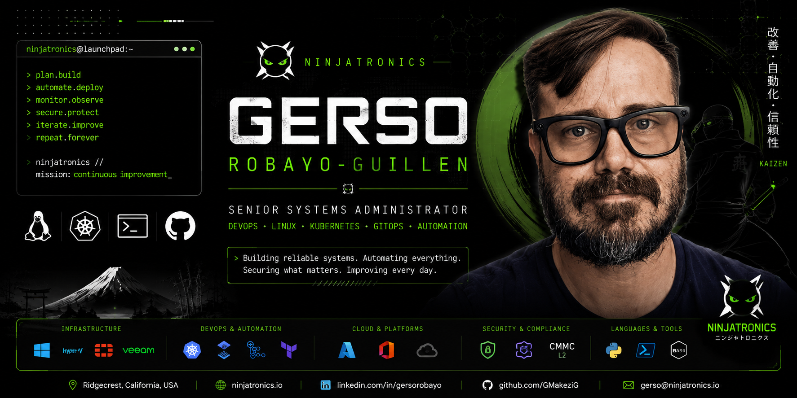

  

  

# Hi, I'm Gerso 👋

I'm a Senior Systems Administrator with over 20 years of experience designing, securing, and automating enterprise infrastructure. I'm currently focused on mastering DevOps with NixOS, Kubernetes, GitOps, cloud automation, and AI-powered workflows.

## 🚀 About Me

- 🏢 Senior Systems Administrator
- 🥷 Founder of Ninjatronics
- ❄️ Learning NixOS
- ☸️ Building Kubernetes homelabs
- 🛡️ Passionate about automation and security
- 🎓 Master's in IT Project Management

## Technology Stack

### Infrastructure and Cloud

### Linux and DevOps

### Development

### Security and Compliance

## 🚀 Featured Projects

- 🥷 **Ninjatronics** — AI-powered developer ecosystem
- ☸️ **Homelab** — NixOS, Kubernetes, FluxCD, Cloudflare
- ❤️ **Mis Hermanos Pequeñitos** — Nonprofit website and infrastructure
- 💰 **Zaifu** — Personal Financial Operating System

## 🎯 Current Mission

- 🥷 Building Ninjatronics AI
- ❄️ Mastering NixOS
- ☸️ Learning Kubernetes & GitOps
- 🤖 Building AI-powered developer workflows
- 🛡️ Transitioning from Senior Systems Administrator to DevOps Engineer

## 📈 GitHub Activity

  

  

  

## 🌐 Connect With Me

